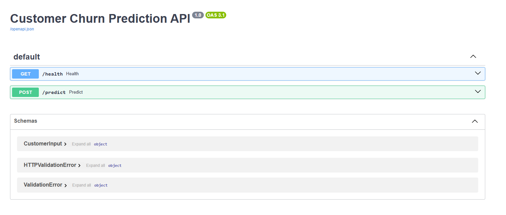
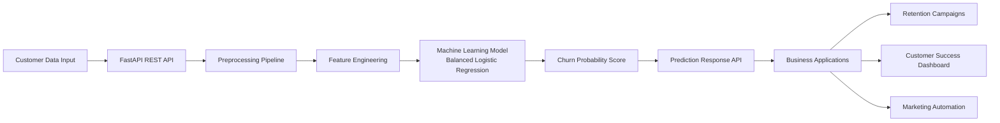

### Customer Churn Prediction using Machine Learning
#### Project Overview

Customer churn is a critical problem for subscription-based businesses such as telecom providers. When customers cancel their services, companies lose recurring revenue and must spend more on acquiring new users.

This project builds an end-to-end machine learning system that predicts which customers are likely to churn, enabling companies to proactively intervene with retention strategies.

The project demonstrates the full data science lifecycle, including data preprocessing, machine learning modeling, model evaluation, and production deployment via a REST API.

#### Business Problem

Telecommunication companies face high customer acquisition costs. Retaining existing customers is significantly cheaper than acquiring new ones.

The objective of this project is to:

1. Identify customers likely to churn
2. Enable targeted retention campaigns
3. Reduce revenue loss

By predicting churn early, companies can prioritize high-risk customers and improve customer lifetime value.

#### Dataset

This project uses the Telco Customer Churn dataset, which contains customer demographics, subscription services, and billing information.

Dataset source:
Kaggle

Dataset summary:

| Metric             | Value |
| ------------------ | ----- |
| Total customers    | 7043  |
| Original features  | 21    |
| Processed features | 30+   |
| Target variable    | Churn |

Data includes:

1. Customer demographics
2. Internet and phone services
3. Billing information
4. Contract details
5. Payment methods

#### Data Preparation

Data preprocessing steps include:

1. Removal of non-informative identifiers (customerID)
2. Conversion of TotalCharges to numeric values
3. Handling missing values
4. One-hot encoding of categorical variables
5. Building a reusable preprocessing pipeline

The preprocessing pipeline ensures consistent transformations during both training and inference.

#### Machine Learning Models

Multiple models were evaluated:

| Model                        | Purpose               |
| ---------------------------- | --------------------- |
| Logistic Regression          | Baseline model        |
| Random Forest                | Non-linear comparison |
| Balanced Logistic Regression | Final model           |

Class imbalance was addressed using:

class_weight="balanced"

This improves the model’s ability to detect churn cases.

#### Model Performance

Final evaluation metrics:
| Metric                   | Score |
| ------------------------ | ----- |
| Accuracy                 | 0.74  |
| Recall (Churn Detection) | 0.79  |
| ROC-AUC Score            | 0.84  |

Interpretation:

The model successfully identifies **approximately 79% of customers who are likely to churn**, enabling businesses to prioritize retention efforts effectively.

The ROC-AUC score of **0.84** indicates strong predictive performance.

#### Key Drivers of Customer Churn

Feature importance analysis identified several major churn factors:

1. Customer tenure
2. Monthly charges
3. Total charges
4. Contract type
5. Internet service type
6. Payment method

Business insight:

Customers with **short tenure and higher monthly charges** are significantly more likely to churn.

#### Production Deployment

## API Demo

The churn prediction model is deployed as a REST API using FastAPI.

Below is the interactive Swagger interface for testing predictions.

The machine learning pipeline is deployed using FastAPI as a REST API.

The API allows real-time predictions for new customers.

Example response:

{
  "churn_probability": 0.82,
  "churn_prediction": 1
}

Interactive API documentation is automatically generated via Swagger UI.

To run the API locally:

uvicorn api.app:app --reload

Access the API documentation:

http://127.0.0.1:8000/docs

#### System Architecture

#### Technology Stack

1. Python
2. Pandas
3. NumPy
4. Scikit-learn
5. FastAPI
6. Uvicorn
7. Matplotlib
8. Seaborn

#### Future Improvements

Potential enhancements include:

1. Gradient boosting models (XGBoost / LightGBM)
2. Hyperparameter tuning with Optuna
3. Real-time churn monitoring dashboard
4. Integration with CRM systems

#### Author

**Abhishek**

Software Engineer exploring Machine Learning, AI, and Data Science.
Building practical ML systems and production-ready APIs.

#### Why This Project Matters

Many machine learning portfolios stop at model training.

This project demonstrates a complete ML system, including:

1. Data preprocessing pipeline
2. Model evaluation with ROC-AUC
3. Handling class imbalance
4. Deployment via REST API

This mirrors how machine learning solutions are built in real-world production environments.

