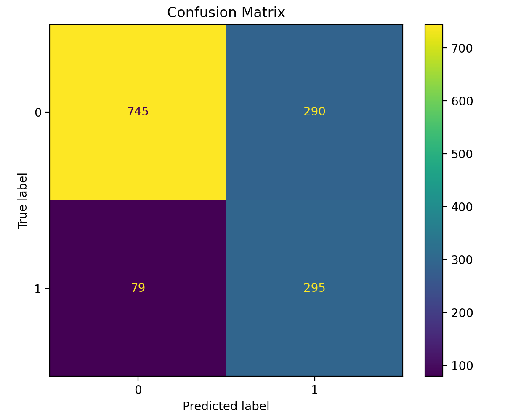
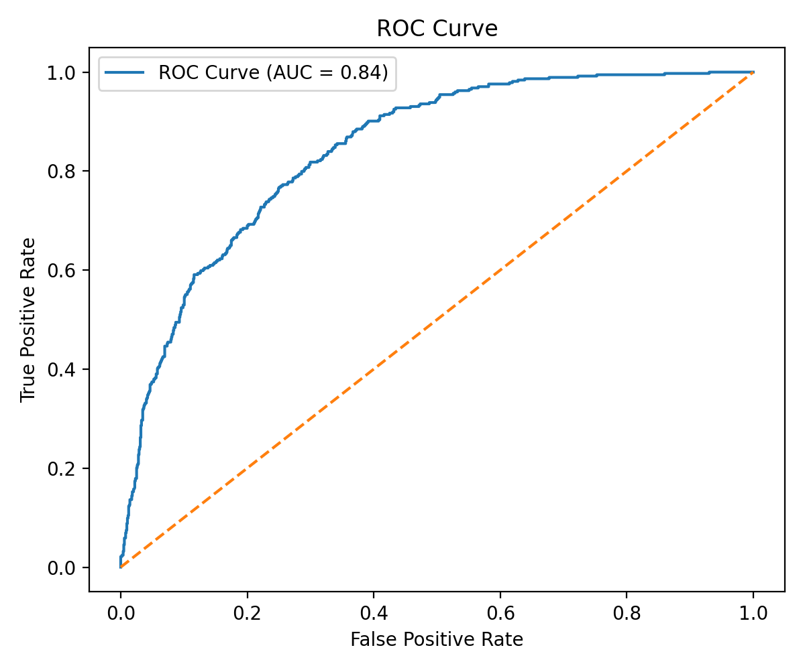
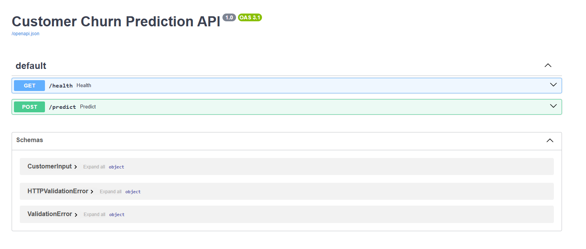

# Customer Churn Prediction Using Machine Learning


An end-to-end machine-learning project that predicts telecom customer churn. It includes data preparation, a reusable scikit-learn pipeline, model evaluation, and a locally runnable FastAPI prediction API.

## Key Features

- Balanced logistic regression for churn classification
- Automated preprocessing for numeric and categorical data
- Reusable training and evaluation scripts
- Saved pipeline for consistent training and inference
- FastAPI endpoints with interactive Swagger documentation

## Model Performance

The model was evaluated on a stratified 20% holdout set containing 1,409 customer records.

| Metric | Score |
| --- | ---: |
| Accuracy | 0.74 |
| Churn recall | 0.79 |
| ROC-AUC | 0.84 |





## Technology Stack

| Technology | Purpose |
| --- | --- |
| Python 3.12 | Application language |
| Pandas | Data loading and preparation |
| scikit-learn | Preprocessing, model training, and evaluation |
| Joblib | Model persistence |
| FastAPI and Pydantic | Prediction API and request validation |
| Uvicorn | Local ASGI server |
| Matplotlib | Evaluation visualizations |

## Project Structure

```text
customer-churn-prediction-ml/
├── api/
│   └── app.py
├── assets/
│   ├── api-demo.png
│   ├── confusion-matrix.png
│   └── roc-curve.png
├── models/
│   └── churn_pipeline.joblib
├── src/
│   ├── evaluate_pipeline.py
│   └── train_pipeline.py
└── requirements.txt
```

## Setup

Clone the repository and create a virtual environment:

```bash
git clone https://github.com/abhishek-datascience-ai/customer-churn-prediction-ml.git
cd customer-churn-prediction-ml
python -m venv .venv
```

Activate it on Windows PowerShell:

```powershell
.\.venv\Scripts\Activate.ps1
```

On macOS or Linux:

```bash
source .venv/bin/activate
```

Then install the dependencies:

```bash
python -m pip install -r requirements.txt
```

Download the [Telco Customer Churn dataset](https://www.kaggle.com/datasets/blastchar/telco-customer-churn) and place the CSV at:

```text
data/raw/WA_Fn-UseC_-Telco-Customer-Churn.csv
```

## Usage

Train and save the pipeline:

```bash
python -m src.train_pipeline
```

Evaluate the saved pipeline:

```bash
python -m src.evaluate_pipeline
```

Start the API from the repository root:

```bash
python -m uvicorn api.app:app --reload
```

Open [http://127.0.0.1:8000/docs](http://127.0.0.1:8000/docs) to test the API through Swagger UI.

| Endpoint | Method | Purpose |
| --- | --- | --- |
| `/health` | `GET` | Check API availability |
| `/predict` | `POST` | Generate a churn probability and prediction |

Example response:

```json
{
  "churn_probability": 0.82,
  "churn_prediction": 1
}
```


